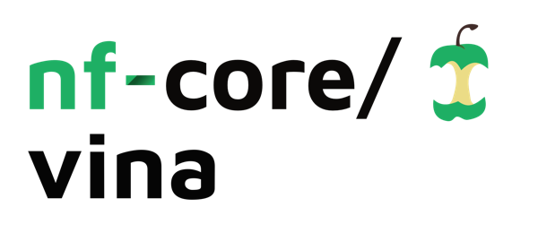
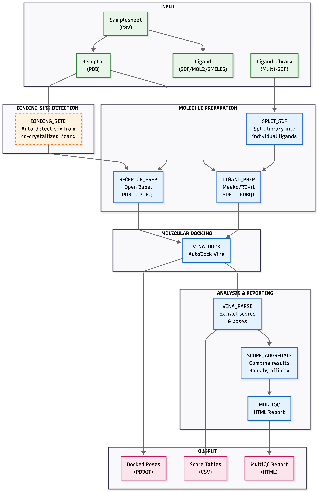
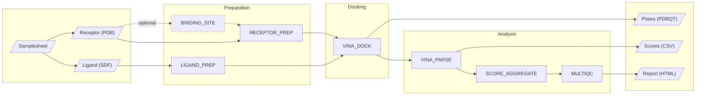

<h1>
  <picture>
    <source media="(prefers-color-scheme: dark)" srcset="docs/images/nf-core-vina_logo_dark.png">
    
  </picture>
</h1>

[](https://github.com/codespaces/new/nf-core/vina)
[](https://github.com/nf-core/vina/actions/workflows/nf-test.yml)
[](https://github.com/nf-core/vina/actions/workflows/linting.yml)[](https://nf-co.re/vina/results)[](https://doi.org/10.5281/zenodo.XXXXXXX)
[](https://www.nf-test.com)

[](https://www.nextflow.io/)
[](https://github.com/nf-core/tools/releases/tag/3.5.1)
[](https://docs.conda.io/en/latest/)
[](https://www.docker.com/)
[](https://sylabs.io/docs/)
[](https://cloud.seqera.io/launch?pipeline=https://github.com/nf-core/vina)

[](https://nfcore.slack.com/channels/vina)[](https://bsky.app/profile/nf-co.re)[](https://mstdn.science/@nf_core)[](https://www.youtube.com/c/nf-core)

## Introduction

**nf-core/vina** is a high-throughput, containerized molecular docking pipeline using **AutoDock Vina** with modern ligand and receptor preparation tools. It is designed for structure-based virtual screening campaigns in drug discovery.



### Key Features

- **Modern toolchain only** - No legacy Python 2.7 dependencies or AutoDockTools
- **Receptor preparation** using Open Babel (PDB to PDBQT with polar hydrogens and Gasteiger charges)
- **Ligand preparation** using Meeko/RDKit (SDF/MOL2/SMILES to PDBQT)
- **Virtual screening mode** - Screen thousands of ligands against multiple receptors efficiently
- **Multi-molecule SDF support** - Automatically split and process compound libraries
- **Auto binding site detection** - Automatically detect docking box from co-crystallized ligands in PDB
- **Docking** with AutoDock Vina >= 1.2
- **Chemically correct** - Proper protonation at specified pH, Gasteiger charges, rotatable bond handling
- **Fully containerized** - Docker, Singularity, Podman, Conda support
- **HPC ready** - SLURM, AWS Batch configurations included

### What This Pipeline Does NOT Use

This pipeline explicitly **avoids deprecated tooling**:

- AutoDockTools (ADT) / MGLTools
- Python 2.7
- `prepare_ligand4.py`, `prepare_receptor4.py`
- AutoGrid (grid defined by box coordinates instead)

### Pipeline Summary

1. **Binding Site Detection** (optional) - Auto-detect docking box from co-crystallized ligand in PDB structure
2. **Receptor Preparation** - Convert PDB to PDBQT using Open Babel with polar hydrogen addition and Gasteiger charges
3. **Ligand Preparation** - Convert SDF/MOL2/SMILES to PDBQT using Meeko/RDKit with proper torsion tree setup
4. **Library Splitting** (virtual screening) - Split multi-molecule SDF files into individual ligands
5. **Molecular Docking** - Run AutoDock Vina with user-defined or auto-detected docking box
6. **Score Parsing** - Extract binding affinities and generate per-sample CSV reports
7. **Aggregation** - Combine all results into summary tables ranked by affinity
8. **Reporting** - Generate MultiQC HTML report with docking results

### Pipeline Diagram



## Usage

> [!NOTE]
> If you are new to Nextflow and nf-core, please refer to [this page](https://nf-co.re/docs/usage/installation) on how to set-up Nextflow. Make sure to [test your setup](https://nf-co.re/docs/usage/introduction#how-to-run-a-pipeline) with `-profile test` before running the workflow on actual data.

First, prepare a samplesheet with your receptor-ligand pairs:

`samplesheet.csv`:

```csv
sample,receptor,ligand,center_x,center_y,center_z
dock_1,/path/to/receptor.pdb,/path/to/ligand1.sdf,10.5,20.3,15.0
dock_2,/path/to/receptor.pdb,/path/to/ligand2.mol2,10.5,20.3,15.0
dock_3,/path/to/receptor.pdb,/path/to/ligand3.smi,10.5,20.3,15.0
```

Each row represents a docking job with a receptor-ligand pair and optional docking box coordinates.

Now, you can run the pipeline using:

```bash
nextflow run nf-core/vina \
   -profile docker \
   --input samplesheet.csv \
   --outdir results \
   --center_x 10.5 \
   --center_y 20.3 \
   --center_z 15.0
```

Or with per-sample box coordinates defined in the samplesheet:

```bash
nextflow run nf-core/vina \
   -profile docker \
   --input samplesheet.csv \
   --outdir results
```

> [!WARNING]
> Please provide pipeline parameters via the CLI or Nextflow `-params-file` option. Custom config files including those provided by the `-c` Nextflow option can be used to provide any configuration _**except for parameters**_; see [docs](https://nf-co.re/docs/usage/getting_started/configuration#custom-configuration-files).

For more details and further functionality, please refer to the [usage documentation](https://nf-co.re/vina/usage) and the [parameter documentation](https://nf-co.re/vina/parameters).

## Pipeline output

The pipeline generates the following outputs:

```
results/
├── binding_site/           # Auto-detected binding site coordinates (if enabled)
├── receptor_prep/          # Prepared receptor PDBQT files
├── ligand_prep/            # Prepared ligand PDBQT files
├── docking/                # Docked poses and Vina logs
├── scores/                 # Per-sample score CSVs
├── results/                # Aggregated results
│   ├── docking_results_all.csv       # All poses from all samples
│   └── docking_results_summary.csv   # Best pose per sample
├── multiqc/                # MultiQC HTML report
└── pipeline_info/          # Execution reports
```

For more details about the output files and reports, please refer to the [output documentation](https://nf-co.re/vina/output).

## Credits

nf-core/vina was originally written by Pritam Kumar Panda.

We thank the following projects and their developers:

- [AutoDock Vina](https://vina.scripps.edu/) - Scripps Research
- [Open Babel](https://openbabel.org/) - Open Babel development team
- [Meeko](https://github.com/forlilab/Meeko) - Forli Lab, Scripps Research
- [RDKit](https://www.rdkit.org/) - RDKit community

## Contributions and Support

If you would like to contribute to this pipeline, please see the [contributing guidelines](.github/CONTRIBUTING.md).

For further information or help, don't hesitate to get in touch on the [Slack `#vina` channel](https://nfcore.slack.com/channels/vina) (you can join with [this invite](https://nf-co.re/join/slack)).

## Citations

An extensive list of references for the tools used by the pipeline can be found in the [`CITATIONS.md`](CITATIONS.md) file.

You can cite the `nf-core` publication as follows:

> **The nf-core framework for community-curated bioinformatics pipelines.**
>
> Philip Ewels, Alexander Peltzer, Sven Fillinger, Harshil Patel, Johannes Alneberg, Andreas Wilm, Maxime Ulysse Garcia, Paolo Di Tommaso & Sven Nahnsen.
>
> _Nat Biotechnol._ 2020 Feb 13. doi: [10.1038/s41587-020-0439-x](https://dx.doi.org/10.1038/s41587-020-0439-x).
