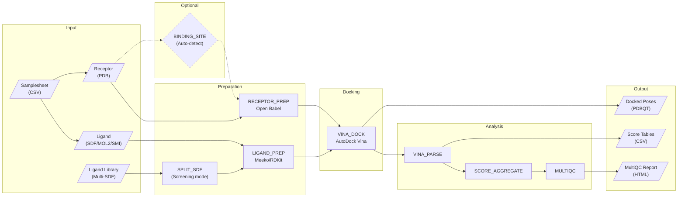

# nf-core/vina Pipeline Diagram

## Pipeline Steps

| Step | Module | Tool | Description |
|------|--------|------|-------------|
| 1 | BINDING_SITE | Python | Auto-detect docking box from co-crystallized ligand (optional) |
| 2 | RECEPTOR_PREP | Open Babel | Convert PDB to PDBQT, add polar hydrogens, compute charges |
| 3 | LIGAND_PREP | Meeko/RDKit | Convert SDF/MOL2/SMILES to PDBQT with torsion tree |
| 4 | SPLIT_SDF | Python | Split multi-molecule SDF for virtual screening (optional) |
| 5 | VINA_DOCK | AutoDock Vina | Perform molecular docking |
| 6 | VINA_PARSE | Python | Extract binding affinities and poses |
| 7 | SCORE_AGGREGATE | Python | Combine and rank all docking results |
| 8 | MULTIQC | MultiQC | Generate HTML summary report |
